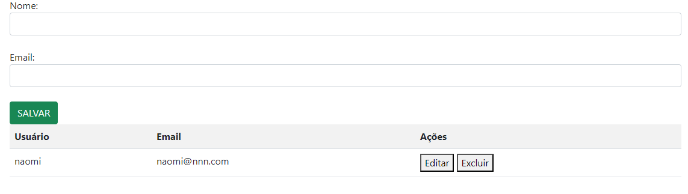
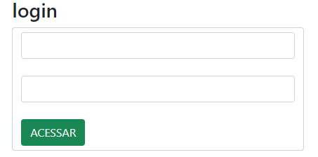
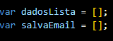
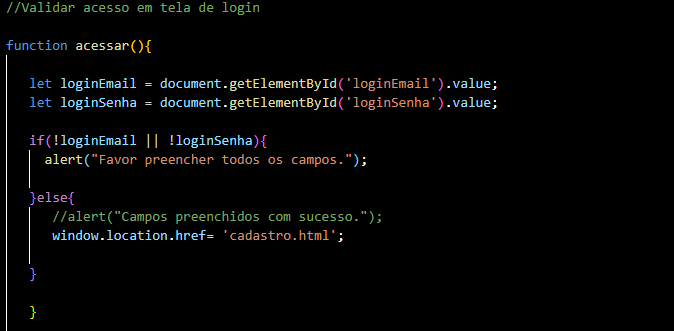
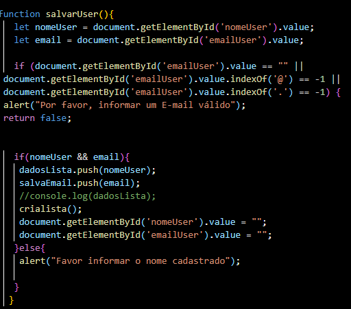
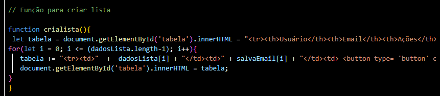

> # LOGIN E CADASTRO

* ## Tela de cadastro   

* ## Tela de login  

 
### Fizemos uma tela de login e uma tela de cadastro com lista de nome nesse projeto com a ajuda do professor. Usamos HTML e JS.

> # EXPLICAÇÃO JS

### Essencialmente, o código gerencia a tela de login e uma tela de cadastro onde você pode adicionar e editar nomes de usuários. 

## ARRAYS

* ### dadosLista: Armazena os nomes dos usuários.

* ### salvaEmail: Armazena os emails dos usuários.  

    

## FUNÇÕES

* ### Função acessar(): Verifica e redireciona se os campos de email e senha estão preenchidos.  

  
 
* ### Função salvarUser(): Adiciona um nome à lista e atualiza a tabela, limpando o campo de entrada.  

  
 
* ### Função crialista(): Constrói e exibe a tabela com os nomes da lista e botões de edição.  

    
 
* ### Função editar(index) : Permite editar um nome removendo-o da lista e atualizando a tabela.  

  

* ### Função excluir (i): Remove um usuário específico da lista.  

  

> # FUNCIONAMENTO 

### O usuário acessa a página de login e, se os campos estiverem preenchidos corretamente, é redirecionado para a página de cadastro. Na página de cadastro, o usuário pode adicionar novos nomes e e-mails a uma lista. A tabela na página de cadastro exibe os usuários com botões para editar ou excluir entradas. Ao editar, os dados do usuário selecionado são carregados nos campos de entrada, permitindo alterações. Ao excluir, o usuário selecionado é removido da lista e a tabela é atualizada.

> # INFORMAÇÕES ADICIONAIS
--------------------------------------------------------------------------------

### Splice: altera o conteúdo de uma lista, adicionando novos elementos enquanto remove elementos antigos.

----------------------------------------------------------------------------------------------